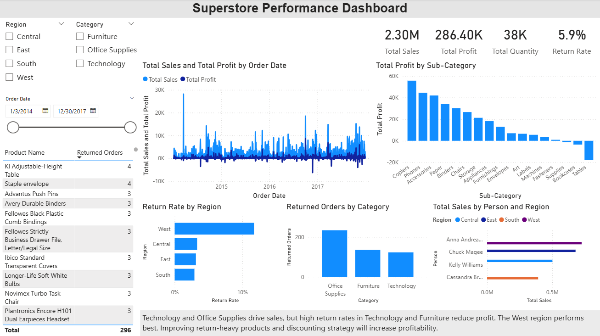

# Superstore Sales Performance Dashboard

## Dashboard Preview

## Project Overview
This project analyzes retail sales performance using the Superstore dataset.  
The dashboard was built using Power BI to explore sales trends, profitability, and product return patterns.

## Tools Used
- Power BI
- DAX
- Data Modeling

## Key Metrics
- Total Sales
- Total Profit
- Total Quantity
- Return Rate

## Dashboard Features
- Sales and Profit trend analysis over time
- Profit comparison by product sub-category
- Regional return rate analysis
- Returned orders analysis by category
- Sales performance by salesperson

## Key Insights
- Technology and Office Supplies generate the highest sales.
- Furniture and Technology show higher return rates.
- The West region demonstrates strong overall sales performance.

## Files
Superstore_Sales_Performance_Dashboard.pbix – Power BI dashboard file
